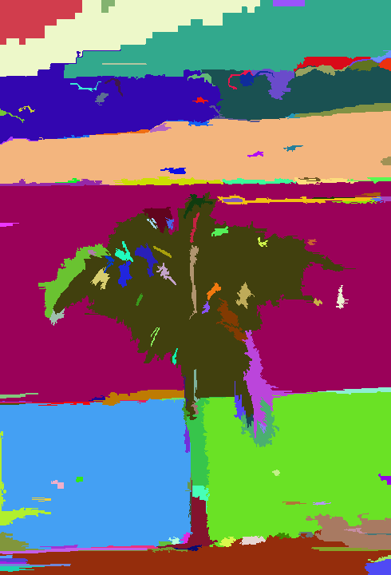

# Super Pixel Generation 
 
---
This program provides a MATLAB wrapper for P. Felzenszwalb's graph based image segmentation code. For the original C++ implementation, please refer to [this page](http://cs.brown.edu/~pff/segment/). And for details of the algorithm, please refer to the paper `Graph Based Image Segmentation`.

If you find any bugs, please contact me at soundsilencebisai-at-gmail-dot-com.

### Usage
To use the program, please run `mex -I.\ segment.cpp` first to build it. For addition instructions, please see `demo.m` for details.

